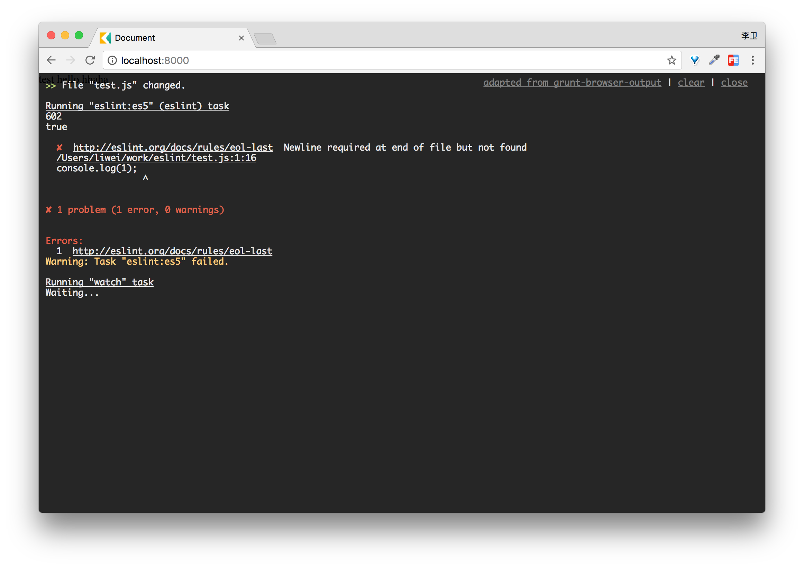

# grunt-terminal-browser

> Show grunt errors in a popup window in your browser.

This plugin forked from [grunt-browser-output](https://github.com/rarila/grunt-browser-output), when I use eslint-friendly-formatter to format eslint error log, grunt-browser-output in browser looks like ugly, so I am take example by Webpack and change some code to make output in browser seens more beautiful.
This plugin will mirror the Grunt console output in a browser window when a plugin
shows warnings or errors. The motivation is to avoid having to toggle back to a terminal window to see errors
(ex. JSHint warnings) during a grunt/watch/livereload session.



Only works in modern browsers with WebSocket support.

## Getting Started

```shell
npm install grunt-terminal-browser --save-dev
```

Once the plugin has been installed, it may be enabled inside your Gruntfile with this line of JavaScript:

```js
grunt.loadNpmTasks('grunt-terminal-browser');
```

**Important: Using this plugin with `grunt-contrib-watch` and `livereload` requires `grunt-contrib-watch` version `0.6.0` or higher and you must configure [livereloadOnError = false](https://github.com/gruntjs/grunt-contrib-watch#optionslivereloadonerror) and [spawn = false](https://github.com/gruntjs/grunt-contrib-watch#optionsspawn)**

## The "terminal_browser" task

### Overview
In your project's Gruntfile, add a section named `terminal_browser` to the data object passed into `grunt.initConfig()`.

```js
grunt.initConfig({
  terminal_browser: {
    options: {       //all options are optional
      port: 37901    //default is 37901
    }
  },
})
```

Add `terminal_browser` before your `watch` task.

```js
grunt.registerTask('serve', ['terminal_browser','connect', 'watch']);
```

Finally, add the following script tag to your web page:
```html
<script src="node_modules/grunt-terminal-browser/client.js"></script>
```

### HTTPS/SSL

If you run your site over HTTPS, you'll likely want to configure this task to also use HTTPS.  Change the task config:

```js
grunt.initConfig({
  terminal_browser: {
    options: {
       ssl: true,
       key: grunt.file.read('path/to/server.key'),
       cert: grunt.file.read('path/to/server.crt')
    }
  },
})
```
And in your index.html add put `?ssl=true` on the end of the client.js script tag:

```html
<script src="node_modules/grunt-terminal-browser/client.js?ssl=true"></script>
```

## Release History
 - 2/18/2017 - v0.2.0 - modify grunt-browser-output.
 - 3/13/2014 - v0.1.0 - Initial release.